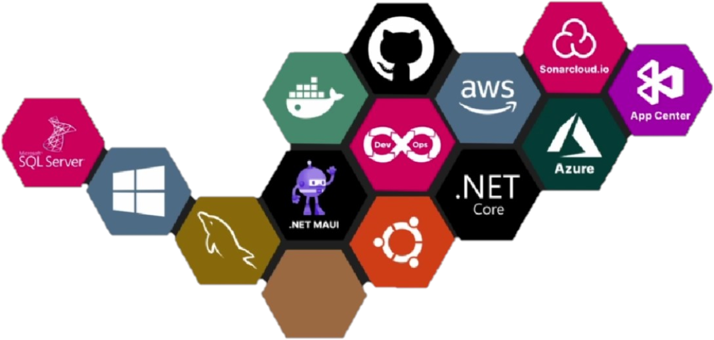

# Oi, Meu Nome é William

[![Linkedin][Linkedin]][Linkedin-will]
[![Instagram][Instagram]][Instagram-will]

## 😄 😁About me

Sou um desenvolvedor de software altamente experiente, com 14 anos de atuação na criação de soluções eficientes e inovadoras. Tenho amplo conhecimento em diversas tecnologias e ferramentas, incluindo **.NET**,  **Entity Framework**, **Oracle/PLSQL** e **SQL Server**.

Minha expertise em **.NET** me permite desenvolver aplicações robustas e escaláveis, utilizando a plataforma para criar soluções personalizadas que atendam às necessidades dos clientes.

Tenho experiência em trabalhar com bancos de dados, incluindo **Oracle/PLSQL e SQL Server**, onde posso projetar, implementar e otimizar consultas e procedimentos armazenados.

Além disso, possuo sólidos conhecimentos em tecnologias front-end, como **HTML e CSS**, que me permitem desenvolver interfaces atraentes e intuitivas. Combinando essas habilidades, sou capaz de criar aplicações completas, desde a camada de apresentação até a camada de acesso a dados.
**Angular**, sou capaz de desenvolver interfaces de usuário interativas e responsivas, garantindo uma experiência de usuário excepcional.

Estou sempre atualizado com as últimas tendências tecnológicas e continuamente aprimorando minhas habilidades nessas áreas. Meu comprometimento com a excelência técnica e minha paixão pelo desenvolvimento de software me impulsionam a buscar constantemente novos desafios e aprendizados. Estou pronto para contribuir de forma significativa para projetos inovadores e equipes de sucesso.

---
## **Minhas habilidades tecnológicas**
Aqui estão alguns dos programas e habilidades tecnológicas que domino:

---

## 🧑🏼‍💻 O que estou aprendendo agora?
### 🧑🏼‍🎓 ** Pós-graduação em Big Data e Inteligência Artifical **
### 📖 **Melhorando os conhecimentos em DevOps e CI/CD**

---

## 📝 **Está trabalhando em algum projeto no momento?**

**Sim!** Estou desenvolvendo um sistema de **e-commerce [LojaVirtual][lojavirtual-url]** utilizando **microsserviços**, **Docker** e **.NET Core 7**, com **Angular** como front-end.

<!------ Urls ----->

[lojavirtual-url]: https://github.com/willsmarques/Will-MicroServices-dotnet6

[Linkedin]:https://img.shields.io/badge/Linkedin--074F97?&style=for-the-badge&logo=linkedin&logoColor=white

[Instagram]:https://img.shields.io/badge/Instagram-A5112D?&style=for-the-badge&logo=Instagram&logoColor=white

[Linkedin-will]:https://www.linkedin.com/in/williammarquesweb/
[Instagram-will]:https://www.instagram.com/williamsantosmar/
